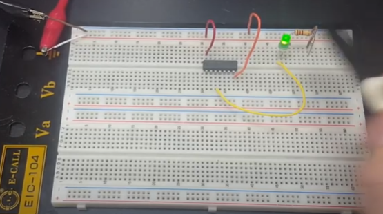
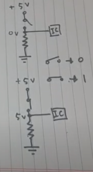
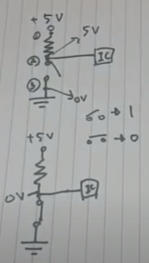

# 디지털 입출력과 PWM

## 1. PWM과 analogWrite()함수

- 디지털 입출력 제어는 LED를 깜빡이거나 릴레이제어, 동일한 속도로 모터를 회전시킬 때 매우 유용함
- 하지만 출력전압으로 0or5V외에 다른값을 출력하려면 DAC를 사용해야 한다

-----------------------------------------------------------------------------------------------------------------------------------------------

*릴레이 제어

 전기전자 기기의 동작을 자동으로 제어할 때 사용

 ex) 일정 온도가 되면 자동으로 냉장고의 냉각기를 정지시키는것, 리모컨으로 TV를 끄는것 등

-----------------------------------------------------------------------------------------------------------------------------------------------------------

- 그러나 PWM 방법을 사용하면 디지털 신호를 아날로그 신호와 비슷하게 만들 수 있다.
- 아두이노는 analogWrite() 함수로 PWM신호를 출력 가능하다 (출력 핀 옆에 ~표시)
- PWM은 신호를 켜거나 끄는 방식으로 네모파의 듀티비(Duty Cycle)를 변조하여 사용한다
- analogWrite()함수는 두 번째 인자값에 따라 네모파의 듀티비를 지정한다
  - 0을 지정하면 네모파의 듀티비는 0%(항상 LOW)로 나타난다
  - 255를 지정하면 네모파의 듀티비는 100%(항상 HIGH)로 나타난다
  - 127을 지정하면 네모파의 듀티비는 50%(반은 HIGH, 반은 LOW)로 나타난다

##  2. 디지털 입력값을 읽는법

풀업/풀다운 저항을 설치하고 소프트웨어로 바운싱 효과를 방지하는 방법을 익히면, 디지털 입력값을 더욱 정확하게 얻을 수 있다.

### 1.풀다운 저항을 사용한 디지털 입력

-먼저 풀다운 저항의 중요성을 이해해야 한다.

풀업저항과 풀다운 저항을 사용하는 이유는 플로팅 상태를 막기 위해서이다

다음 그림이 플로팅 상태

OR게이트 칩의 입력선이 없어도 신호가 1로 출력이 되는데 해당 핀 근처에 전기적 노이즈가 간섭한다 이를 플로팅이라고 한다. 따라서 예측하지 못한 입력값이 생기며 HIGH와 LOW 사이에서 불규칙하게 왔다갔다 한다.

- 풀다운 저항

  

  위의 그림과 같이 버튼이 열려있으면 전위차에 의해 버튼의 저항이 무한대이므로 0의 입력이 들어간다

  반면에 버튼이 닫혀있으면 5V신호 그대로 IC에 들어가기 때문에 1의 입력이 들어간다

- 풀업 저항

위의 그림과 같이 버튼이 열려있으면 전위차에 의해 5V의 전압이 그대로 IC에 들어가기 때문에 1의 입력이 발생하고 반면에 버튼이 닫혀있으면 전위차가 0V이므로 0의 신호가 입력된다.

--------------------------------------------------------------------------------------------------------------------------

- 약한 풀다운 저항과 강항 풀다운 저항

저항값이 크면 더 작은 전류로도 스위칭 효과를 줄 수 있고, 전기 충격에는 강하나 출력 전류를 제한하기에 약한 풀다운 저항이라 한다. 저항값이 작으면 더 큰 전류를 사용해야 스위칭 효과를 줄 수 있고 전기 충격에는 약하나 충분한 출력 전류를 사용할 수 있어 강한 풀다운 저항이라 한다.

-------------------------------

###  2.버튼의 스위칭 바운싱 해결

버튼을 한번 누르면 켜지고 한번누르면 꺼지게끔 하는것이 현실적이지만 방법이 생각만큼 쉽지 않다. 기계적 현상인 스위치 바운싱(채터링 or 진동 잡음) 때문에 스위치가 꺼짐에서 켜짐으로 변경되는 값을 알아내기 어렵기 때문

이러한 스위칭 바운싱 효과를 제거하는 방법을 디바운싱이라고 한다

디바운싱 프로그램 흐름

1. 이전 버튼 상태와 현재 버튼 상태(초기 상태로 LOW를 지정)를 저장한다
2. 현재 버튼 상태를 읽어온다
3. 입력값이 이전 버튼 상태와 다를 때는 바운싱이 끝날 때까지 5ms 동안 기다린다
4. 5ms 후에 버튼 상태를 다시 읽어서 그 값을 현재 버튼 상태로 저장한다
5. 이전 버튼 상태가 LOW이고 현재 버튼 상태가 HIGH라면, LED상태를 전환(toggle)한다.
6. 이전 버튼 상태의 변수값에 현재 버튼상태를 입력한다.
7. 단계 2를 반복한다.