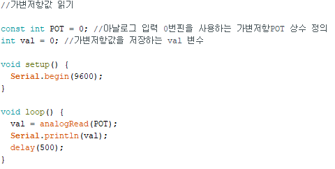

# **아날로그 신호와 센서값**

-이 장에서는 아날로그의 무한한 값을 아두이노 등 마이크로컨트롤러 시스템으로 분석 가능한 디지털값으로 변환하는 방법을 다룬다

## 1 아날로그 신호와 디지털 신호

### 1)아날로그 신호와 디지털 신호 비교

디지털 신호는 오직 HIGH값과 LOW값만 갖는다

반면에 코사인 파형을 나타내는 아날로그 사이의 값은 무한하다.

컴퓨터의 메모리와 성능은 유한하기 때문에 무한한 아날로그 값을 하나하나 측정하기란 불가능하다. 그 답은 ADC에 있다.

### 2)아날로그 신호를 디지털 신호로 변환하는 방법

아두이노에 내장된 ADC핀은 아날로그 전압값을 프로그램에서 사용할 수 있는 디지털값으로 변환해준다.

ADC의 정확도는 해상도(비트수)로 결정된다. 아두이노Uno는 10비트 ADC를 사용하여 0~1023의 값으로 나타낼 수 있다.

## 2. 아두이노로 읽는 아날로그 센서값 analogRead()

아날로그 신호를 인식하는 방법은 analogRead() 함수를 사용하는 것이다. 우선은 가변저항과 아날로그 센서를 살펴보고, 전압분배기가 어떻게 작용하는지 알아본다

### 1)가변저항값 읽기

- 가변저항은 가장 읽기 쉬운 아날로그 센서이다. 
- 오디오,스피커,온도조절 장치,자동차등 우리 주변에서도 쉽게 찾아볼 수 있다.

- analogRead() 함수를 사용하여 아날로그 입력 핀의 값을 읽고 읽은 값은 Serial.println()함수를 사용하여 시리얼 모니터로 출력할 수 있다.

- Serial.begin()함수에는 통신 속도 또는 baud rate를 지정하는 하나의 인수가 필요하다.
- baud rate는 초당 전송되는 비트 수를 지정한다. baud rate가 빠를수록 더 적은 시간에 많은 데이터를 전송할 수 있지만 일부 통신장치에는 오류가 발생할 수 있다. 9600이 범용적인 속도
- loop함수를 돌때마다 val변수는 0번핀에서 읽은 가변저항값을 현재값으로 설정한다
- analogRead 함수는 인수를 핀 번호로 인식하므로 A0입력해도 핀 번호가 지정되지만 짧게 0을 입력해도 무관

### 2) 다양한 아날로그 센서

- 가속도계 : 기울기를 감지(스마트폰, 태블릿)
- 자력계 : 자기장을 감지(디지털 방위계를 만들 수 있음)
- 적외선 센서 : 물체의 거리를 탐지
- 온도 센서 : 주변의 온도를 감지

