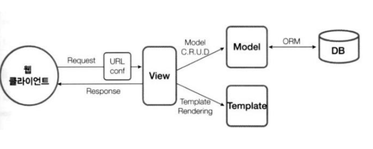
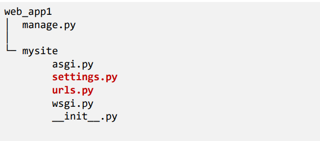
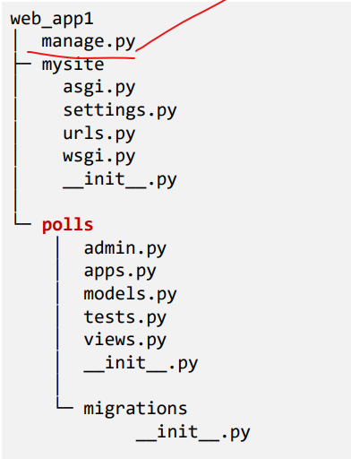
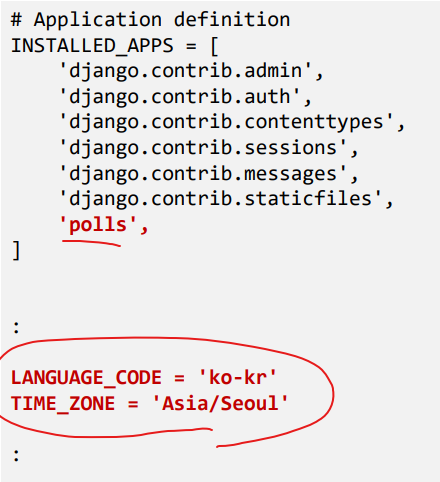

# Django 웹 프레임 워크

## 1. 장고 프로그램 골격 만들기

- 가상환경 만들기
  - conda create -n iot python=3.7
  - conda activate iot

- 장고 설치
  - (iot) pip install Django

- 장고 패턴

- 프로젝트 뼈대 만들기
  - 프로젝트 만들기
  - (iot) django-admin startproject mysite
  - (iot) ren mysite web_app1
  - (iot) cd web_app1
  - web_app1 프로젝트 디렉토리를 IDE로 오픈

- polls 앱 만들기
  - (iot) python manage.py startapp polls

- polls 앱 만들기
  - mysite/settings.py
  - settings에 app을 추가한다

- 프로젝트 초기화
  - 기반 데이터베이스 테이블(계정 관리) 만들기
  - (iot) python manage.py migrate   # DB에 테이블 생성
  - 프로젝트 디렉토리에 db.sqlite3 파일 생성됨

- 웹 서버 기동
  - (iot) python manage.py runserver
  - 브라우저로 접속

- 슈퍼 유저 만들기
  - (iot) python manage.py createsuperuser
  - 슈퍼유저로 관리자 페이지 로그인

- 슈퍼계정