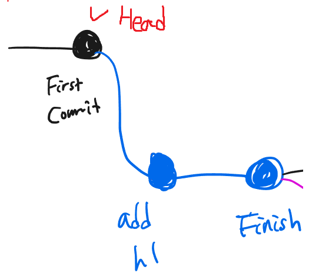
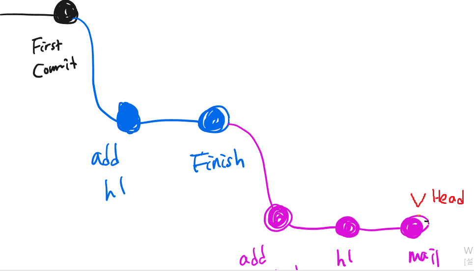
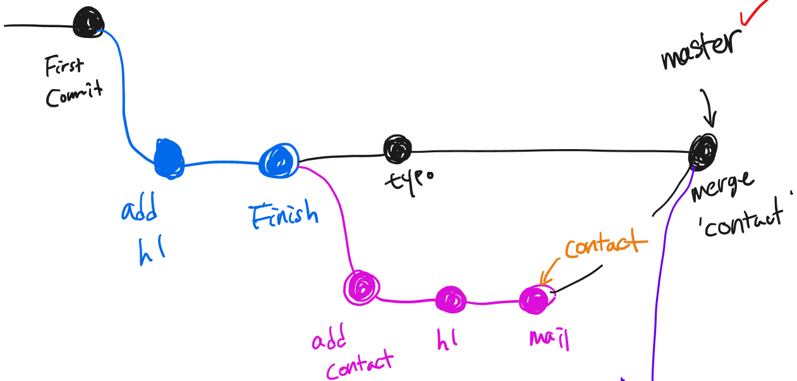
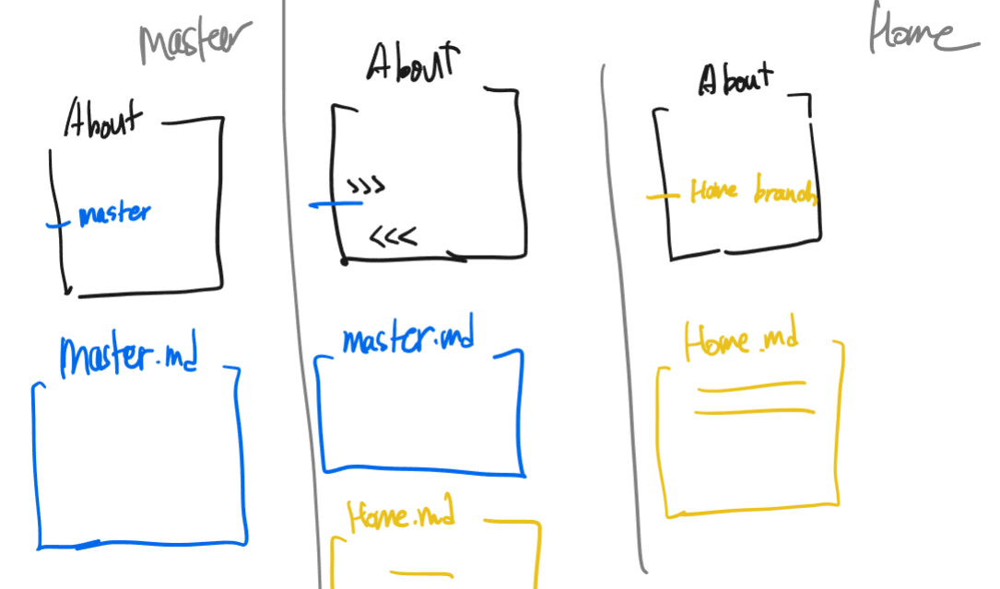

# 2번째 Git 수업

- remote repo(원격 저장소) : 내컴퓨터에 있는 저장소를 로컬 GitHub같은 곳을 remote repo(원격 저장소라고 부른다

- HEAD  : 

  내가 현재 보고있는곳을 말하며 파란색선은 branch (미래)라고 할 수 있다 

  그래서 Head가 first commit상태에서 git branch로 목록을 확인하고자 한다면 나오지 않지만 Head를  finish에 두고 git branch로 확인한다면 first commit , add h1, fisish 다 확인할 수 있다.

  branch과정에서 commit을 한다면 자동으로 head는 마지막 commit으로 이동한다 

  head를 움직이고 싶다면 switch나 checkout 을 이용한다

- fast forward : 

  그림과 같이 master에서 merge를 한다면 갈림길이 없기 때문에 그대로 따라가서 따로 commit을 추가할 필요없이 merge 가능하다

- merge :

  

  이건 반자동 merge : 새로운 commit지점이 발생하는데 vcs에 따라 자동으로 해주는 것도 있고 수동으로 해주는 경우도 있기 때문이다.

- conflict

  

  그림과 같이 다른branch에서 같은 파일내용 같은 줄의 내용을 merge할때 conflict가 발생한다 문서나 visual code로 들어가서 master내용을 할지 home의 내용을 할지 결정하거나 사용자가 따로 작성을 해도 된다 

## 배운내용 명령어 정리

| 명령어                                                  | 설명                                                         |
| ------------------------------------------------------- | ------------------------------------------------------------ |
| git remote add origin <URL>(git remote add <name><URL>) | remote 저장소에 URL주소를 가리킨다 (ex GItHub 주소를 가리키면 GitHub로 가리키는 역할) |
| git push origin master(git push <name><branch>)         | 로컬 저장소에 저장된 origin(<name>)안의 파일들을 remote 저장소에 보낸다 |
| git branch                                              | 브랜치 목록 확인                                             |
| git branch <branch>                                     | branch라는 branch 생성                                       |
| git branch -d <branch>                                  | branch 삭제                                                  |
| git branch -D<branch>                                   | branch 강제 삭제                                             |
| git switch <branch>                                     | Head 를 branch로 옮긴다                                      |
| git switch -c <branch>                                  | branch라는 명의 branch를 만들고 Head를 옮긴다                |
| git checkout <branch/commit_id>                         | branch/commit_id 로 돌아가서(head) 볼수있다                  |
| git merge <branch>                                      | master에 branch를 합친다                                     |
| git remote -v                                           | 연결된 URL을 확인                                            |
| git clone <URL>                                         | URL의 리포지토리를 그대로 가져온다                           |
| touch .gitignore                                        | gitignore 생성                                               |

프로젝트 실행시 해야 할 순서

1. touch .gitignore
2. touch README.md
3. git init => add => commit