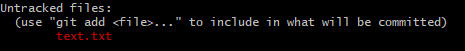
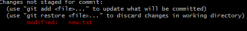
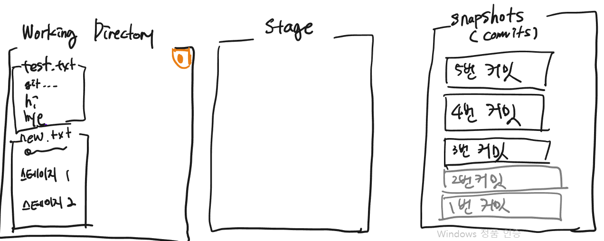

# Git 기초

## 1. git 핵심 주제어들

- VCS : VCS(Version Control System)란? 파일 변화를 시간에 따라 기록했다가 나중에 특정 시점의 버전을 다시 꺼내올 수 있는 시스템

- Untracked : 

  컴퓨터(카메라)가 현재 폴더에서 text.txt파일을 처음보는 상태이다 `$git add`로 스테이지로 올린다음 commit을 해야한다
  
- staged : 

  수정 사항들이 아직  stage에 올라가지 않은 상태

## 2. git 저장소 만들기

- 컴퓨터의 c:/user/(username) 이곳에서 생성하며 홈이라고 부른다

- 저장소로 설정할 파일위치에서`$git init`  으로 초기화를 해준다(카메라 설치)

###   1)리포지토리(저장소)에 변경사항 기록하기

- 먼저 저장소에는 크게 3개의 구역(1. 워킹디렉토리, 2. 스테이지, 3. 스냅샷(commit)이 있다 )

  

- 게임으로 비유를 하자면 1.워킹디렉토리=스타트 포인트 2. 스테이지 = 세이브포인트(유/무 가능), 3.commit = 로드포인트

- 워킹디렉토리 내부 변경사항이 생기면 스테이지에 올린후 commit에 기록을 할 수 있다.

###   2)git 명령어 모음

| 명령어                                  | 설명                                                         |
| --------------------------------------- | ------------------------------------------------------------ |
| git config --global user.name "이름"    | 사용자 이름 설정                                             |
| git config --global user.email "이메일" | 사용자 이메일 설정                                           |
| git init                                | 현재 폴더를 초기화 해준다(카메라 설치)                       |
| git status                              | 현재 폴더의 상태를 알려준다(변경사항이 있는지 and 스테이지의 유무도 파악 가능) |
| git log                                 | commit 히스토리를 알 수 있다.                                |
| git add<파일명><폴더명>                 | 파일,폴더를 스테이지에 올린다                                |
| git commit -m '<입력할 메세지>'         | commit 메세지를 달아준다(필수)                               |
| git restore <파일명><폴더명>            | 최근 commit의 상태로 돌아간다 (현재 작업 내용 날라감!)       |

## 3. CLI 기초명령어 모음

| 명령어                     | 설명                                                         |
| -------------------------- | ------------------------------------------------------------ |
| cd <폴더 명>               | 폴더명으로 이동한다                                          |
| ls <폴더 명>               | 폴더안의 리스트 출력                                         |
| cd ..                      | 현재폴더의 상위폴더로 이동                                   |
| mkdir <폴더 명>            | 폴더 생성(띄어쓰기 하고 칠 경우 여러개 생성 가능)            |
| touch <파일 명>            | 파일 생성(띄어쓰기 하고 칠 경우 여러개 생성 가능)            |
| mv <파일명><폴더명/파일명> | 파일을 입력한 폴더로 이동                                    |
| mv <파일명><바꿀파일명>    | 현재 파일을 바꿀파일명으로 변경                              |
| vim <파일명>               | 파일을 수정할 수 있다(i(insert) : 수정 / esc : 명령어모드 / :w 저장 / :q 종료) |
| rm <파일명>                | 해당 파일 삭제                                               |
| rmdir<폴더명>              | 폴더 삭제(빈 폴더가 아닐 경우 삭제 안됨)                     |
|                            |                                                              |

