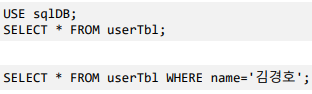
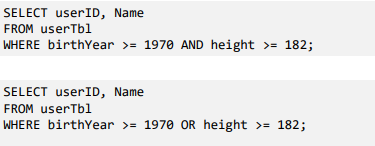
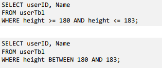

# 데이터베이스 모델링

## 1.데이터베이스 모델링

- 테이블간의 관계 설정

- SELECT

  - 테이블의 내용 출력

    -SELECT 필드목록

    FROM 테이블명

    [WHERE 조건]

    [GROUP BY 컬럼명]

    [HAVING 조건]

    [ORDER BY 컬럼명]

    

  - WHERE 절 - 관계 연산자(AND, OR, NOT)의 사용

    

  - WHERE 절 - BETWEEN.... AND, IN() 그리고 LIKE

  

  

- ANY/ALL/SOME 그리고 서브쿼리(SubQuery, 하위쿼리)
  - 서브쿼리
    - FROM/WHERE 절에 SELECT문을 제시
    - 서브 쿼리는 반드시()안에 작성

SELECT Name, height FROM userTBL WHERE height > 177;

-키가 177보다 큰 사람 출력

SELECT Name, height FROM userTBL

​	WHERE height > (SELECT height FROM userTbl WHERE Name = '김경호');

-김경호의 키보다 큰 사람 출력

SELECT Name, height FROM userTBL

​	WHERE height >= (SELECT height FROM userTbl WHERE addr='경남');

-이 경우 모든 경남사람보다 키큰 사람인지 경남 아무 사람키보다 큰것만 하는지 모호하기 때문에 ANY/ALL을 써야한다

SELECT Name, height FROM userTBL 

WHERE name LIKE '김%';

-% : 아무 글자가 와도 상관없음 (개 수에 제한 없음)

SELECT Name, height WHERE name like '_종신';

-_ : 한글자로 아무 글자가 와도 상관없음

  

- 원하는 순서대로 정렬하여 출력
  - 오름차순 : ASC(디폴트, 생략가능)
  - 내림차순 : DESC

SELECT Name, mDate FROM userTBL ORDER BY mDate;

-mDate의 오름 차순으로 정렬

SELECT Name, mDate FROM userTBL ORDER BY mDate DESC;

-mDate의 내림 차순으로 정렬

- 중복된 것은 하나만 남기는 DISTINCT

SELECT DISTINCT addr FROM userTBL

- 출력하는 개수를 제한하는 LIMIT

SELECT emp_no, hire_date FROM employees

ORDER BY hire_date ASC

LIMIT 5;

- 테이블을 복사하는 CREATE TABLE ..SELECT
  - 기존 테이블과 동일한 구조로 테이블 생성
  - KEY 제약조건은 복사되지 않음
    - 필드의 이름, 타입, 길이, NULL여부가 동일
  - 특정 컬럼(SELECT 절 제시) 또는 특정 행만 (WHERE절 제시)복사 가능

형식] CREATE TABLE [새로운 테이블명] (SELECT 복사할 열 FORM 기본테이블명)

  

CREATE TABLE buyTBL2 (SELECT * FROM buyTBL);

SELECT * FROM buyTBL2

- GROUP BY  그리고 집계함수
  - GROUP BY 절
    - 특정 컬럼에 대해 동일한 값을 가지는 행들을 하나의 행으로 처리
    - 통계 작업에 사용

SELECT userID as '사용자 아이디', SUM(amount) as '총 구매 개수'

FROM buyTBL

GROUP BY userID;

- HAVING절
  - GROUP BY 결과에서 필터링

SELECT userID as '사용자', SUM(price*amount) AS '총구매액'

FROM buyTBL

GROUP BY userID

HAVING SUM(price*amount) > 1000;

- SQL문의 종류
  - DDL : Data Definition Language
    - 데이터베이스 객체(테이블, 인덱스, 뷰)의 생성, 수정, 삭제 조작
  - DML: Data Manipulation Language
    - 데이터의 선택, 삽입, 수정, 삭제 등 데이터 조작
    - SELECT, INSERT, UPDATE, DELETE
  - DCL : Data Control Language
    - 권한 부여

## 2. 데이터 변경을 위한 SQL문

- 데이터의 삽입 : INSERT

[형식]

INSERT INTO 테이블[(열1, 열2, ...)]

VALUES(값1, 값2, ...)

-열을 생략하면 테이블에 있는 모든 열에 대해 값을 제시, 이경우 순서는 테이블 생성시 제시한 열의 순서

-열을 제시하면 순서에 맞춰 값 제시

USE sqlDB;

CREATE TABLE testTBL1(id int, userName char(3), age int);

INSERT INTO testTBL1 VALUE (1, '홍길동', 25);

INSERT INTO testTBL1(id, userName) VALUES(2,'설현');

INSERT INTO testTBL1(userName, age, id) VALUES ('초아', 26, 3)

- 자동 증가하는 AUTO_INCREMENT
  - 값을 제시하지 않은 경우 자동 증가 값으로 추가
  - PRIMARY KEY필드에 주로 사용
  - @@auto_increment_increment 서버변수로 전역설정할수 있음

CREATE TABLE testTBL2(id int AUTO_INCREMENT PRIMARY KEY,

​											userName char(3)

​											age int);

ALTER TABLE testTBL2 AUTO_INCREMENT = 100;

- 데이터 수정 : UPDATE문

[형식]

UPDATE 테이블이름

SET 열1 = 값1, 열2 = 값2

[WHERE 조건]  --- 조건이 없으면 전체 행이 수정

UPDATE testTBL4

SET Lname = '없음'

WHERE Fname = 'Kyoichi';

- 데이터 삭제 : DELETE FROM

[형식]

DELETE FROM 테이블 이름

[WHERE 조건]; -- 조건이 없으면 전체 행이 삭제

DELETE FROM testTBL4 WHERE Fname = 'Aamer';