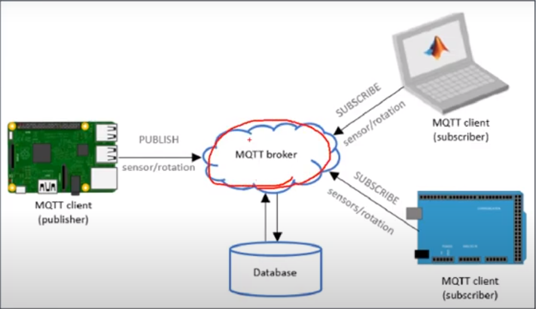

# MQTT개요
## 1) MQTT

- MQTT(Message Queue Telemetry Transport)
  - (http://www.joinc.co.kr/2/man/12/MQTT/Tutorial)
  - 경량의 Publish/Subscribe(Pub/Sub) 메시징 프로토콜
  - M2M(machine-to-machine)와 IoT(Internet of things) 분야 적용
  - 특징
    - 저전력
    - 신뢰할 수 없는 네트워크에서 운용 가능
    - No TCP/IP 기반 우영 가능
    - --> 소형기기의 제어와 센서정보 수집에 유리

- 용어정리
  - Client
    - MQTT의 broker에 연결된 모든 것을 말한다
  - Broker
    - Broker는 모든 메시지를 수신, 필터링, 메시지 구독하는 사람 결정
    - 클라이언트에게 메세지를 보내는 역할을 한다.
  - Publish
    - topic을 지정하여 topic을 subscribe 하고 있는 클라이언트에게 메시지를 보낸다
  - Subscribe  
    - 토픽을 구독하여 topirc으로 publish된 메세지를 받는다
  - Topic
    - MQTT의 topic은 슬래쉬(/)를 분리 문자로 사용하여 폴더 및 파일과 유사한 계층 구조를 가진다