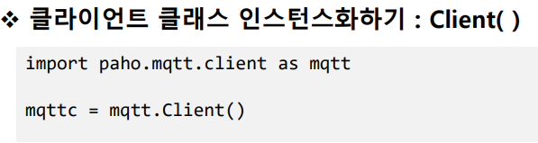

# MQTT개요
## 1) MQTT

- MQTT(Message Queue Telemetry Transport)
  - (http://www.joinc.co.kr/2/man/12/MQTT/Tutorial)
  - 경량의 Publish/Subscribe(Pub/Sub) 메시징 프로토콜
  - M2M(machine-to-machine)와 IoT(Internet of things) 분야 적용
  - 특징
    - 저전력
    - 신뢰할 수 없는 네트워크에서 운용 가능
    - No TCP/IP 기반 우영 가능
    - --> 소형기기의 제어와 센서정보 수집에 유리

- 용어정리
  - Client
    - MQTT의 broker에 연결된 모든 것을 말한다
  - Broker
    - Broker는 모든 메시지를 수신, 필터링, 메시지 구독하는 사람 결정
    - 클라이언트에게 메세지를 보내는 역할을 한다.
  - Publish
    - topic을 지정하여 topic을 subscribe 하고 있는 클라이언트에게 메시지를 보낸다
  - Subscribe  
    - 토픽을 구독하여 topirc으로 publish된 메세지를 받는다
  - Topic
    - MQTT의 topic은 슬래쉬(/)를 분리 문자로 사용하여 폴더 및 파일과 유사한 계층 구조를 가진다

## 2) Paho 모듈

- 클라이언트 클래스 인스턴스화하기 : Client()

  Client(client_id = '', clean_session = True, userdata = None, protocol=MQTTv311,transport='tcp')

  - client_id
    - 브로커에 연결할 때 사용되는 고유 클라이언트 ID문자열
    - 비어있거나 None인 경우 무작위로 결정
      - 이 경우 clean_session은 True여야 한다
  - clean_session
    - 브로커와 연결이 끊어졌을 때 브로커가 클라이언트의 정보를 지울지 여부
  - userdata
    - 핸들러에서 사용한 사용자 정의 데이터 타입
  - protocol
    - MQTT 버전
  - transport
    - 전송 프로토콜('tcp'또는 'websocket')

  

- 연결 : connect()

  connect(host, port=1883, keepalive=60, bind_address='')

  - host 
    - 브로커의 호스트명 또는 ip주소
  - port
    - 프로커의 포트 번호
  - keepalive
    - 브로커와 통신 사이에 허용되는 최대 기간(초)
    - 다른 메시지가 교환되지 않으면 클라이언트가 브로커에 ping 메시지를 보낼 속도를 제어
  - bind_address
    - 네트워크 인터페이스(랜카드)가 여러 개인 경우 , 바인딩할 ip주소
  - 콜백
    - 연결 성공시 on_connect() 콜백 호출

- 네트워크 루프(프로그래밍)
  - subscriber는 지속적으로 수신을 해야 한다
  - loop(timeout)
    - 1개의 mqtt 메시지 수신/전송을 처리
    - 주로 publish할 때 직접 호출
  - loop_start()
    - 새로운 스레드를 생성, 새로 생성된 스레드가 loop()를 호출함
      - 생성되는 스레드는 데몬스레드(메인 스레드가 종료할 때 함께 종료됨)
    - 자동으로 reconnect 실행됨
    - 멈출때는 loop_stop()
  - loop_forever()
    - 현재 스레드로 loop()호출
    - 무한 루프이므로 현재 스레드로는 다른 작업을 할 수 없음

- 토픽 발간하기 : publish()

  publish(topic, payload = None, qos = 0, retain = False)

  - topic
    - 메시지를 게시 할 주제
  - payload
    - 전송할 메시지
    - 문자열 또는 바이트 데이터 (struct.pack()필요)
  - qos
    - qos 수준
  - retain
    - True 설정한 경우, 해당 토픽에 대한 가장 최근의 메시지 유지

- 콜백

  - 특정 이벤트(접속 성공, 메시지 수신 등)가 발생했을 때 호출되는 핸들러(함수)

    

    on_connect(client, userdata, flags, rc)

    - 브로커가 연결 용청에 응답할 때 호출

    - client 

      -이 콜백의 클라이언트 인스턴스

    - userdata

      -Client() 또는 user_data_set()에서 설정한 사용자 데이터

    - flags

      -브로커가 보낸 응답 플래그

    - rc

      -연결 결과

      -0 : 연결 성공

      -1~5 : 연결 거부

      -6~255 : 현재 사용되지 않습니다

    

    on_disconnect(client, userdata, rc)

    - 브로커와 연결이 끊어질 때 호출

    - client

      -이 콜백의 클라이언트 인스턴스

    - userdata

      -Client() 또는 user_data_set()에서 설정한 사용자 데이터

    - rc

      -처리 결과

      -0 : 정상적으로 끊김

      -0이 아닌 값 : 예외에 의해 끊어짐

    

    on_message(client,userdata,message)

    - subscriber에서 메시지(토픽)가 수신됐을 때 호출

    - client

      -이 콜백의 클라이언트 인스턴스

    - userdata

      -Client() 또는 user_data_set()에서 설정한 사용자 데이터

    - message

      -MQTTMessage 인스턴스

      -속성 : topic, payload, qos, retain

