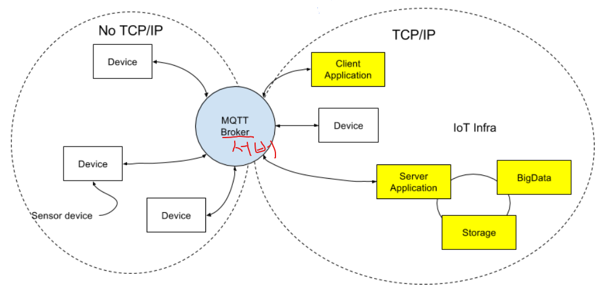
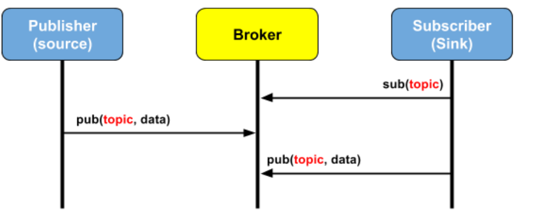

# MQTT

## 1. MQTT

- MQTT(Message Queue Telemetry Transport)
  - (https://www.joinc.co.kr/w/man/12/MQTT/Tutorial)
  - 경량의 Publish/Subscribe(Pub/Sub) 메시징 프로토콜
  - M2M(machine - to -machine)와 IoT 분야 적용
  - 특징
    - 저전력
    - 신뢰할 수 없는 네트워크에서 운용가능
    - No TCP/IP 기반 운영 가능

-> 소형기기의 제어와 센서정보 수집에 유리

- 활용
  - 센서 (Sensor) 정보 수집
  - 제어
    - 센서로 부터 받은 데이터를 토대로 기기 제어
    - 각 기기에 MQTT broker를 설치 또는 중앙 MQTT broker에 bind
  - Message Push Server
    - 모바일 애플리케이션을 위한 메시지 Push서버
    - 페이스북의 경우 MQTT를 이용해서 메시지를 push하고 있음

- MQTT특징
  - Publish/Subscribe
    - Publisher과 Subscriber은 모두 broker에 대한 클라이언트로 작동
    - Publisher는 토픽을 발행
    - Subscriber은 토픽을 구독
    - 둘 다 Broker 서버에 연동
  - 
  - 토픽
    - Pub와 Sub는 토픽을 기준으로 작동
    - 토픽은 슬래시(/)를 이용해서 계층적으로 구성
    - 대량의 센서 기기들을 효율적으로 관리

## 2. Paho 모듈

- paho-mqtt 모듈
  - MQTT Python Client 모듈
  - 설치 sudo pip3 install paho-mqtt

- 구독자(Subscriber) 개발 절차
  - MQTT 클라이언트 클래스 인스턴스화
  - 브로커 연결
  - 토픽 구독 신청
  - 토픽 수신시 호출할 핸들러 등록
  - 토픽 수신 대기
  - 토픽 수신시 처리 - 핸들러 호출

- 발행자(Publisher) 개발 절차
  - MQTT클라이언트 클래스 인스턴스화
  - 브로커 연결
  - 필요시 토픽 발행(전송)

