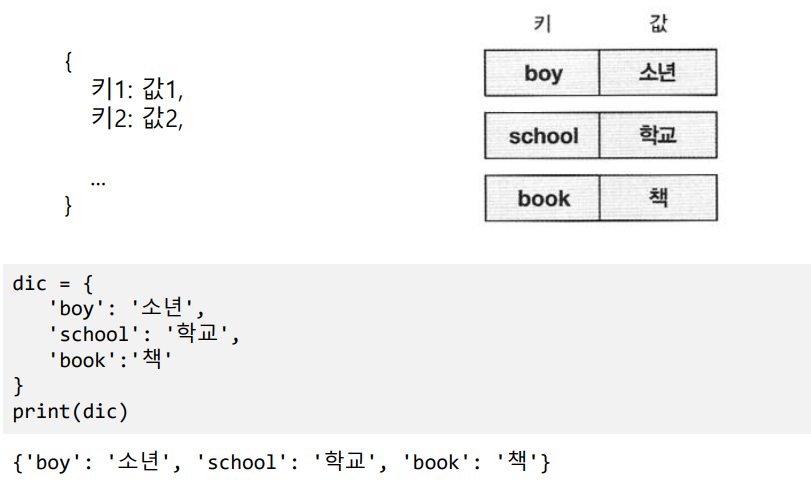
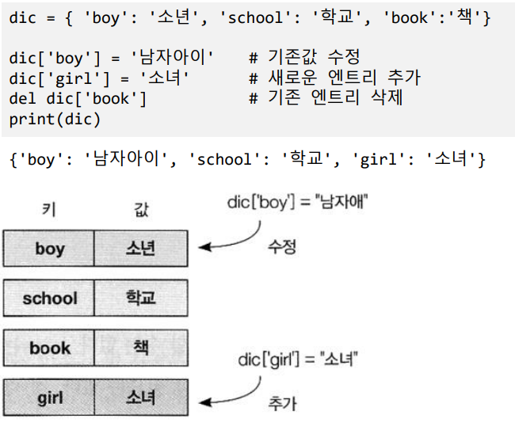
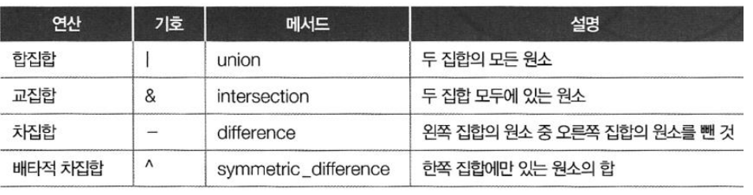

# Ch10 사전과 집합

## 1) 사전

- 키와 값의 쌍

- 사전 관리
  - 사전[키]
    - 키의 값을 리턴, 키가 존재하지 않는 경우 예외 발생
  - 사전.get(키 [, 기본값])
    - 키의 값을 리턴, 키가 존재하지 않는 경우, None 리턴, 키가없을때 리턴할 값 지정 가능
  - .keys()
    - 키 목록 리턴
  - .values()
    - 값 목록 리턴
  - .items()
    - (키,값) 튜플 목록 리턴

## 2) 집합

- 집합 정의
  - {값1, 값2, ....}
  - 값의 중복을 허용하지 않음
  - set(다른 시퀀스)
    - 집합 변환 함수
  - .add(값)
    - 집합에 값 추가, 이미 값이 있으면 추가하지 않음
  - .remove(값)
    - 집합에서 값을 제거, 값이 없는 경우 예외 발생

- 집합 연산

