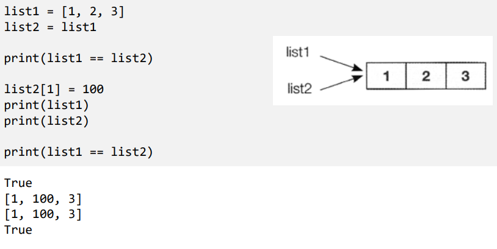

# Ch11 컬렉션 관리

## 1) 컬렉션 관리 함수

- enumerate
  - enumerate(시퀀스,[, start])
    - 시퀀스의 인덱스와 요소를 튜플 묶어서 순회

- zip
  - zip(시퀀스1, 시퀀스2) -> [(값1, 값2), .....]
  - 시퀀스의 길이가 다른 경우 가장 짧은 시퀀스의 길이에 맞춤

- any(), all()
  - any(시퀀스)
    - 시퀀스 하나라도 True가 있으면 True 리턴
  - all(시퀀스)
    - 시퀀스의 모든 요소가 True이면 True 리턴

## 2) 람다 함수

- filter
  - filter(판정함수, 시퀀스)  => 시퀀스
    - 시퀀스의 각 요소를 판정함수에 전달하여 True를 리턴하는 요소로만 구성된 새로운 시퀀스 리턴

- map
  - map(적용시킬함수, 시퀀스)

- 람다함수
  - 한 줄로 정의되는 함수의 축약  표현
  - 함수의 이름이 없음
    - 변수에 대입해서 사용
  - lambda 인수 : 식

## 3) 컬렉션의 사본

- 리스트의 사본
  - 시퀀스.copy() -> 시퀀스 복사본

- is 연산자
  - 두 변수가 같은 객체를 가르키고 있는지 조사

