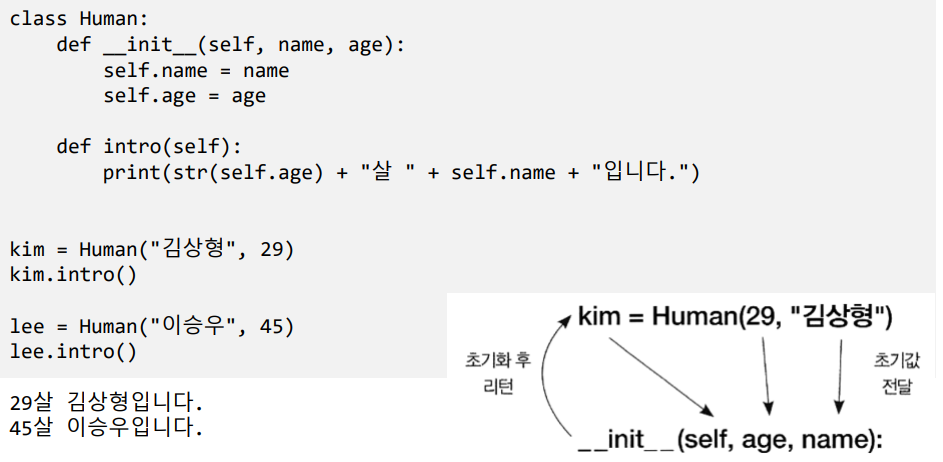

# Ch15 클래스

## 1)클래스

- 클래스
  - 관련 정보와 정보의 조작 함수(메서드)를 묶어서 관리

- 클래스 정의
  - class 키워드로 정의
    - 사용하기 위해서는 인스턴스를 생성한 후 사용

- 생성자

  - ㅡㅡinitㅡㅡ(self)
    - 클래스의 인스터스를 생성할 때 자동으로 호출
    - 멤버 변수 정의 및 초기화 역할

  class 이름:

  ​	def ㅡㅡinitㅡㅡ(self,초기값):

  ​		멤버 초기화

  ​	메서드 정의

객체 = 객체명(인수)

