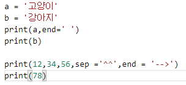
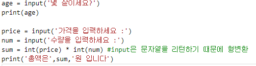

# Ch2 변수

## 기본구조

### 1) 소스 형식

- 들여쓰기 중요
  - 동일 레베인 경우 들여쓰기가 모두 같아야 함
- 대소문자 구분
- #이후는 주석문 (실행되지 않음)

### 2) 출력

- print(출력 내용,[ ,  sep=구분자],[ , end = 끝 문자])

결과 :

고양이 강아지

12^^34^^56 --> 78

### 3) 입력

- 변수 = input('질문내용')
- input 함수는 문자열 타입으로 리턴

결과 : 

가격을 입력하세요 : 500

수량을 입력하세요 : 10

총액은 5000 원 입니다.

- 변수
  - 값을 저장하고 있는 메모리에 대한 명칭
  - 알파벳, 밑줄, 숫자로 구성
  - 첫 글짜로 숫자는 사용 불가
  - 대소문자를 구분
  - 키워드 사용 불가

- 변수 사용
  - 값의 타입이 고정되어 있지 않음
  - 어떠한 값이든 대입가능
  - 선언되지 않은 변수 또는 삭제된 변수를 읽으면 예외 발생

