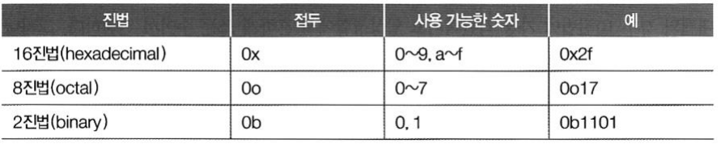
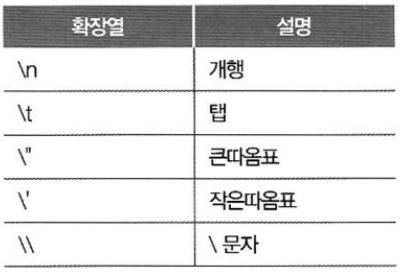

# Ch3 타입

## 1. 수치형

- 수치형 타입
  - 정수
  - 실수
  - 복소수

- 정수형
  - 크기에 제한이 없음
  - 값에 따라 크기 자동 조정 됨
  - 진법에 따라 표기 및 해석

## 2.문자열

- 문자열
  - 큰 따옴표("), 작은 따옴표(')로 묶음
    - 한줄로표현
  - 삼중 따옴표(""")
    - 여러 줄로 표현 가능
  - 여는 따옴표와 닫는 따옴표는 동일해야 함
  - 따옴표 안에 동일한 따옴표는 사용하지 못함

- 문자열 확장(문자 이스케이프)
  - 개행 문자와 같은 특수 문자를 표기하는 방법

## 3. 그 외의 타입

- 진위형(부울린)
  - True, False 두 가지 값만 가짐

- None
  - 어떠한 값도 없음을 나타냄

- 컬렉션 소개 
  - List
  - Tuple
    - 읽기 전용
  - 사전(dict)
    - 키와 값의 쌍으로 관리

