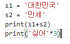

# Ch4 연산자

## 1. 대입 및 산술

- 대입 연산자 ('=')
  - 어떠한 값을 변수에 저장하는 것
  - 직접 값을 지정
  - 연산의 결과를 값으로 사용
  - 사용하지 않는 변수를 읽으면 예외 발생

- 산술 연산자
  - '+,-,*,/'
  - ** : 거듭제곱
  - // 정수나누기
  - % 나머지

- 복합 대입 연산자('+=')
  - 변수의 반복 사용을 줄여 주는 축약 표현
  - a+=1  (a= a+1)

- 문자열 연산
  - 문자열 연결(+)
  - 문자열 연결(*)

결과:

대한민국만세

싫어싫어싫어

- 정수와 문자열
  - 문자열만 +로 연결 가능
    - 다른 타입을 연결하려면 str()함수로 문자열로 변환 후 결합
  - str() : 문자열 변환
  - int() : 정수형 변환
  - int(정수, 진법)

- 실수의 변환
  - float() : 실수 변환 함수
  - round(숫자 [,반올림 자리수]) : 실수 반올림 함수

- 기타 타입 변환
  - bool() : 부울 변환 함수
  - list() : 리스트 변환 함수
  - tuple() : 튜플 변환 함수
  - dict() : 사전 변환 함수