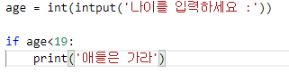
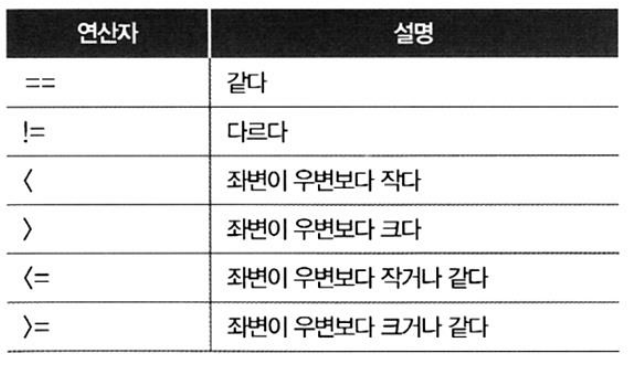
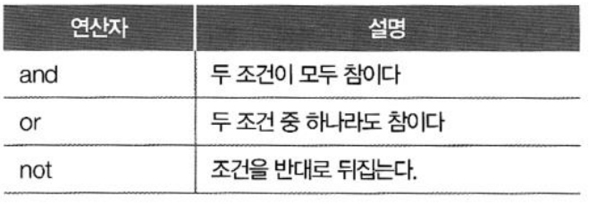
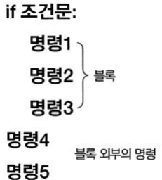
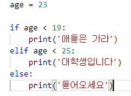

# Ch5 조건문

## 1. if 조건문

- if문
  - 단일 라인 표현식
  - if 조건 : 명령

결과 :

나이를 입력하세요 : 15

애들은 가라

- 비교연산자
  - if 문의 조건에서 주로 사용

- 거짓 값
  - False
  - None
  - 0
  - ""  : 비어있는 문자열
  - [],() : 비어있는 컬렉션

- 논리 연산자

## 2. 블록구조

- 블록구조
  - if 문의 명령이 여러 줄인 경우
  - 이들 명령은 모두 동일한 들여쓰기를 해야 함

- else문
  - if 문에서 조건이 False인 경우 실행할 명령 지정

- elif문
  - 여러 개의 if 문으로 조건을 검사할 때 사용

결과 :

대학생입니다

