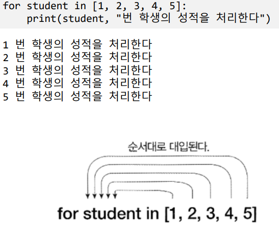
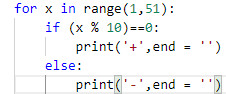

# Ch6 반복문

## 1. 반복문

- while 문
  - 조건이 참인 동안 명령 블럭을 실행

- for 문
  - 컬렉션의 요소를 하나씩 꺼내 명령 블럭을 실행
  - 컬렉션의 모든 요소를 다 사용하면 반복을 끝냄
  - range(시작,끝,증가값)

- 제어 변수의 활용

결과 :

---------+---------+---------+---------+---------+

- break
  - 반복문을 벗어나게 함

- continue
  - continue 이후 명령을 실행하지 않고 당므 반복을 시작

- 이중 루프
  - 루프 안에 루프를 실행

- 무한 루프
  - while 문의 조건이 항상 True
  - 반복 문에서 조건을 검사하여 break로 벗어남