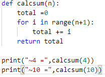
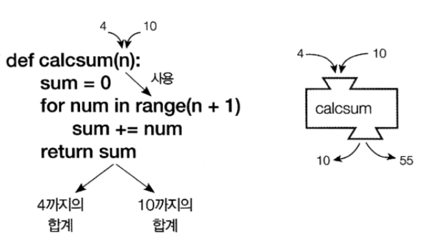
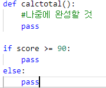
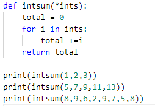
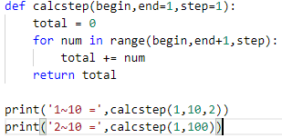
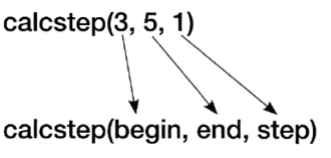
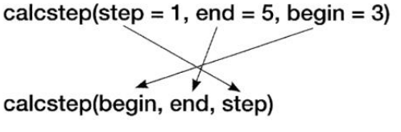
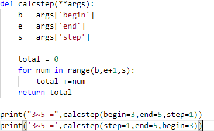
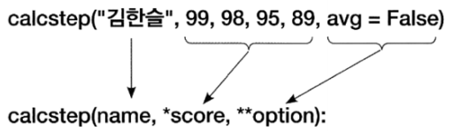

Ch7 함수

## 1) 함수와 인수

- 반복되는 코드

  - 함수로 정의하여 반복을 없앰

    -함수 정의 : def 함수명(인수 목록):

    -함수 호출 : 함수명(인수목록)

    

결과 :

~4 = 10

~10 = 55

- 인수
  - 함수로 값을 전달했을 때 이를 저장하는 변수

- 리턴값
  - 함수의 실행 결과를 호출한 곳으로 넘기는 값

- pass
  - 아무것도 안하고 넘어감
  - 함수는 반드시 코드 블럭이 있어야함
    - 실제 구현을 나중을 미루고자 할때 pass지정

## 2) 인수의 형식

- 가변인수
  - 인수의 수가 고정되지 않음
  - 호출시 원하는 만큼 인수를 지정
  - 함수에서는 이를 튜플 변수로 받음
  - 일반 인수 뒤에만 올 수 있음
  - 하나만 사용 가능

결과 :

6

45

54

- 인수의 기본값(default)
  - 함수 호출시 인수가 지정되지 않았을 때 사용할 값
  - 함수 정의시 인수에 값을 대입
  - 인수 목록의 마지막 부분에 배정
  - 중간에 배정시 구분 불가

결과:

1~10 = 25

2~10 = 5050

- 키워드 인수
  - 일반적으로 함수 호출시 인수의 배치 순서대로 매칭
  
    
  
  - 인수 순서가 아닌 인수의 명칭으로 매칭하는 방법

- 키워드 가변 인수
  - 키워드 인수를 가변 개수로 전달할 때 사용하는 방법
  - **기호로 지정하여 타입은 사전(dictionary)이 됨

결과 :

3~5 = 12

3~5 = 12

- 일반 변수, 가변 변수, 키워드 가변 변수 모두 사용
  - 일반 변수, 가변 변수, 키워드 가변 변수 순서로 배치

- 지역변수
  - 함수 내에서 사용된 변수
  - 함수 내에서만 사용 가능
    - 함수 밖에서 사용 불가

- 전역변수
  - 어디서든 접근 가능한 변수
  - 탑 레벨에서 사용된 변수

