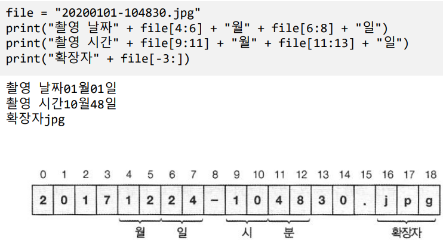
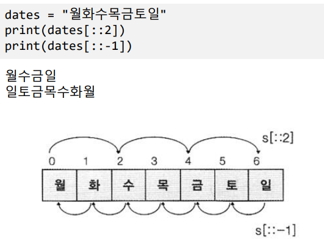
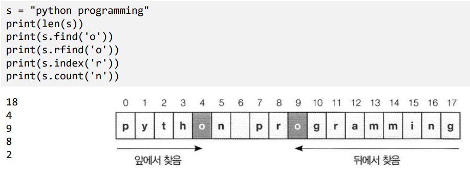

# Ch8 문자열 관리

## 1) 문자열 분리

- 첨자
  - 문자열[정수]   ------------ 0부터 인덱싱
  - 문자열[-정수] ------------- 끝에서부터 인덱싱

- 슬라이싱
  - 문자열[begin : end : step]
    - step : 음수면 뒤에서부터 진행

## 2) 문자열 메서드

- 검색
  - .find(str)  :  str 문자열을 찾아 인덱스 반환, 없으면 -1 반환
  - .rfind(str) : 뒤에서 str 문자열을 찾아 인덱스 반환, 없으면 -1반환
  - .index(str) : find()와 동일, 없으면 예외 발생
  - .count(str) : str문자열이 몇번 등장하는지 리턴

- 조사
  - 단어 in 문자열 --> bool
  - 단어 not in 문자열 --> bool
  - .startswith(str) --> bool
  - .endswith(str) --> bool

- 기타 메서드
  - isalpha : 모든 문자가 알파벳인지 조사
  - islower : 모든 문자가 소문자인지 조사
  - isupper : 모든 문자가 대문자인지 조사
  - isspace : 모든 문자가 공백인지 조사
  - isalnum : 모든 문자가 알파벳 또는 숫자인지 조사
  - isdecimal : 숫자로만 구성되어있는가
  - isdigit : 숫자로만 구성되어있는가
  - isnumeric : 숫자로만 구성되어있는가
  - isidentifier : 명칭으로 쓸 수 있는 문자로만 구성되어 있는지 조사
  - isprintable : 인쇄 가능한 문자로만 구성되어 있는지 조사

- 변경
  - .lower() : 모두 소문자로 바꾼 새로운 문자열을 리턴(원본은 그대로)
  - .upper() : 모두 대문자로 바꾼 새로운 문자열을 리턴
  - .swapcase() : 대문자는 소문자로, 소문자는 대문자로 변환
  - .capitalize() : 첫글자는 대문자 나머지는 소문자로 변환
  - .title() : 모든 단어의 첫 글자를 대문자로 나머지는 소문자로 변환
  - .strip() : 좌우에 있는 공백을 제거
  - .lstrip() : 왼쪽에 있는 공백을 제거
  - .rstrip() : 오른쪽에 있는 공백을 제거

- 분할
  - .split(구분자) : 구분자를 기준으로 단어를 분리하여 리스트로 리턴, 디폴트는 공백
  - .splitlines() : 개행 문자를 기준으로 분리 , 개행문자만 있는 경우 비어있는 문자열로 처리
  - 결합문자열.join(문자열) : 글자들을 결합문자열로 연결하여 하나의 문자열로 리턴

- 대체
  - .replace(기존문자열,대체문자열)
    - 기존 문자열을 대체문자열로 대체
  - .center(폭숫자)
    - 좌우에 공백을 채워 폭숫자만큼 문자열 길이를 맞춤
  - .ljust(폭숫자)
    - 왼쪽에 공백을 채워 폭숫자만큼 문자열 길이를 맞춤
  - rjust(폭숫자)
    - 오른쪽에 공백을 채워 폭숫자만큼 문자열 길이를 맞춤

- 포맷팅
  - %d : 정수
  - %f : 실수
  - %s : 문자열
  - %c : 문자 하나
  - %h : 16진수
  - %o : 8진수
  - %% : % 문자
  - %[-]폭[.유효자리수]서식, 폭에는 소수점에 포함, 반올림 발생