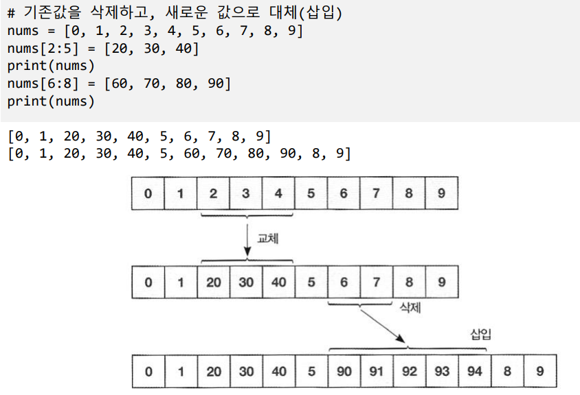
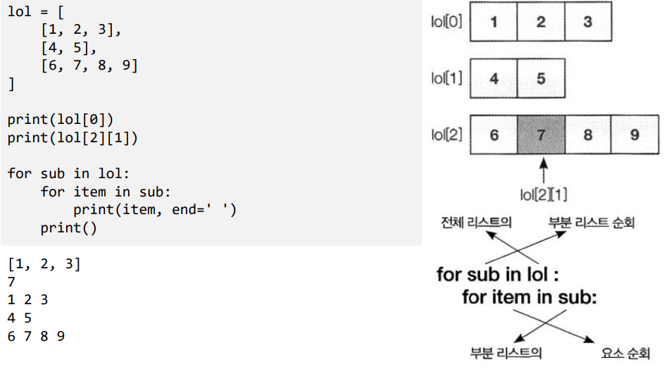
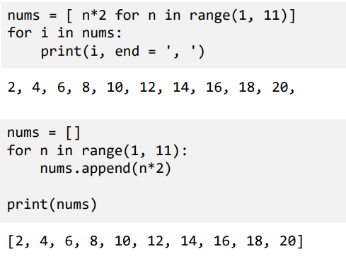
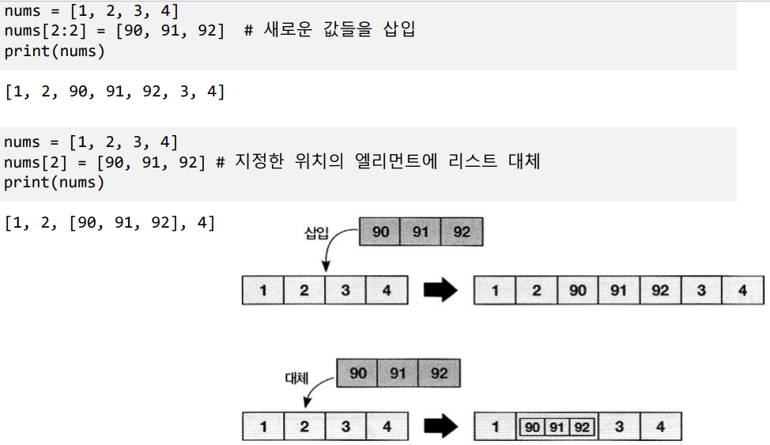
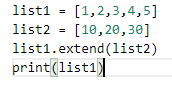
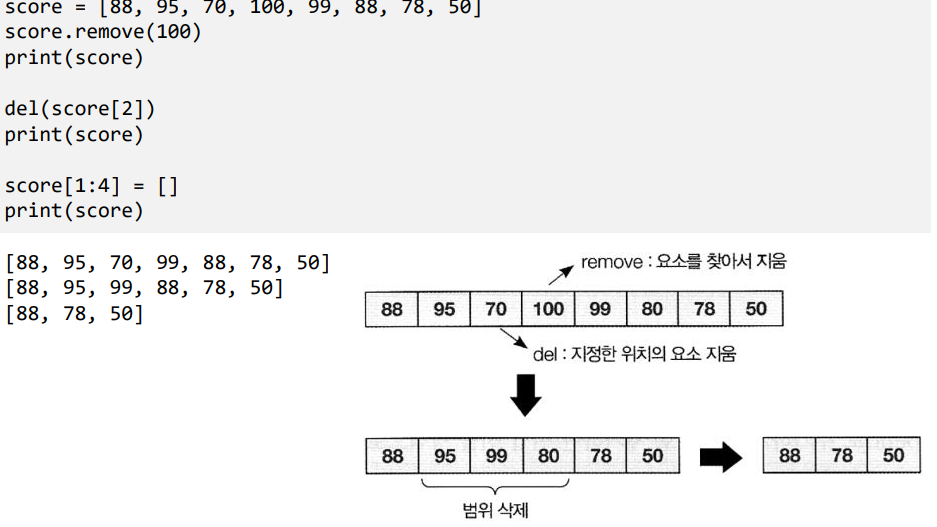
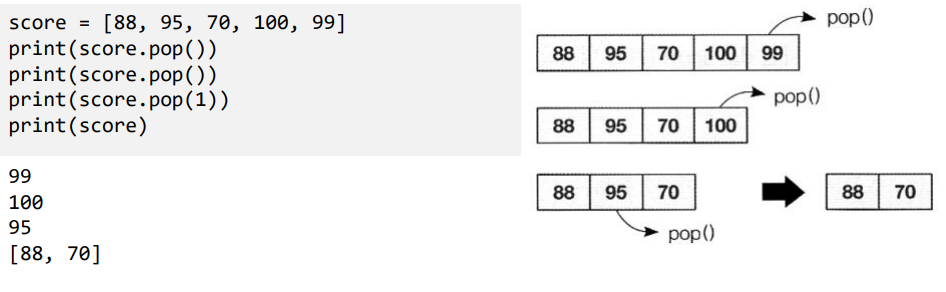
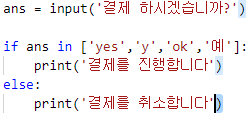
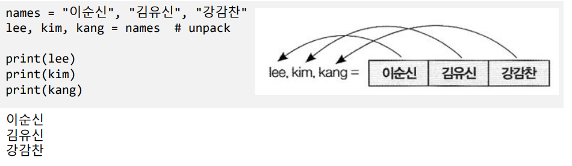

# Ch9 리스트와 튜플

## 1) 리스트

- 자료의 집합

- 리스트의 요소
  - 리스트[인덱스]
  - 리스트[begin : end : step]

- 이중 리스트

- 컴프리핸션
  - [수식 for 변수 in 리스트 if조건]
    - 내부의 리스트를 순회하며 각 요소에 대한 수식을 적용하여 최종 요소를 생성
    - if 조건을 추가하면 조건을 만족하는 요소만 추가

ㄴ

## 2) 리스트 관리

- 삽입
  - .append(값)
    - 리스트의 끝에 값을 추가
  - .insert(위치, 값)
    - 지정한 위치에 값을 삽입

- 리스트 연결
  - 리스트1.extend(리스트2)
  - 리스트1 = 리스트1 + 리스트2

결과 : 

[1, 2, 3, 4, ,5, 10, 20, 30]

- 삭제

  - .remove(값)
    - 리스트에서 값을 찾아 첫번째 해당 요소를 제거
  - del(리스트[인덱스])
    - 지정한 인덱스의 요소를 제거
  - [시작:끝]=[]
    - 지정한 범위의 요소를 제거

  

  - .pop() 
    - 리스트의 끝 요소를 삭제하고 삭제한 요소를 리턴
  - .pop(인덱스)
    - 지정한 인덱스의끝 요소를 삭제하고 삭제한 요소를 리턴

- 검색
  - .index(값)
    - 지정한 값을 찾아 해당 요소를 리턴, 없으면 예외 발생
  - .count(값)
    - 지정한 값이 리스트에 몇 번 나오는지 계산하여 리턴
  - len(시퀀스)
    - 시퀀스의 길이(요소 수) 리턴
  - max(시퀀스)
    - 시퀀스 요소중 최대값 리턴
  - min(시퀀스)
    - 시퀀스 요소중 최소값 리턴
  - 값 in 시퀀스, 값 not in 시퀀스
    - 값이 시퀀스에 포함되어 있는지 여부를 True/False로 리턴
    - 

- 정렬
  - .sort([reverse=True] [key = 키에 적용할 함수])
    - 리스트를 정렬(디폴트는 오름차순), reverse=True로 오름차순/내림차순 선택
  - .reverse()
    - 리스트의 순서를 역으로 바꿈
  - sorted(시퀀스)
    - 지정한 시퀀스를 정렬하여 새로운 리스트로 리턴

## 3) 튜플

- 불변 자료 집합
  - (값, ...)
  - 값,[...]
  - 추가/수정/삭제 불가
  - 읽기만 가능 --->리스트보다 속도가 빠름

- 튜플로 가능한 일
  - unpacking

