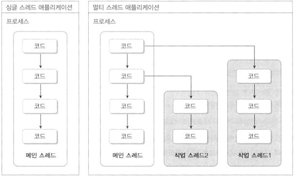
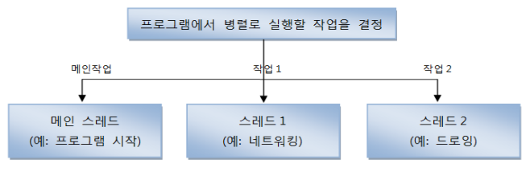
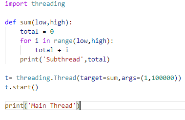
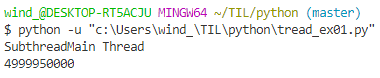
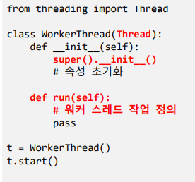

# 스레드

## 1) 멀티스레드

- 프로세스

  - 실행중인 하나의 프로그램
  - 하나의 프로그램이 여러 프로세스로 만들어짐

  

- 멀티태스킹
  - 두가지 이상의 작업을 동시에 처리하는것
  - 멀티 프로세스
    - 독립적으로 프로그램들을 실행하고 여러 가지 작업 처리
  - 멀티 스레드
    - 한 개의 프로그램을 실행하고 내부적으로 여러 가지 작업 처리

- 메인스레드

  - 모든 프로그램은 메인 스레드가 실행하면서 시작

  - 실행 파일의 첫 코드부터 아래로 순차적으로 싫애

  - 더이상 실행할 코드가 없는 경우 종료

  - 

    

  - 실행 종료 조건

    - 마지막 코드 실행
    - return문을 만나면

  - main 스레드는 작업 스레드를 만들어 병렬로 코드를 실행

    - 멀티 스레드 생성해 멀티 태스킹 수행

  - 프로세스의 종료 

    - 싱글스레드 : 메인 스레드가 종료하면 프로세스도 종료
    - 멀티스레드 : 실행중인 스레드가 하나라도 있으면 프로세스 미종료

  

- 멀티 스레드로 실행하는 어플리케이션 개발
  
  - 몇 개의 작업을 병렬로 실행할지 결정하는 것이 선행

- threading 모듈
  - Thread 클래스
  - 스레드 운영방법
    - Thread에게 작업 함수를 전달해서 실행
    - Thread 클래스를 상속받아 재정의
      	- run()메서드 재정의
  - 스레드의 기동
    - start() 호출

## 2) 스레드 함수

- threading 모듈

  - threading.Thread() 함수를 호출하여 Thread 객체 생성
    - 생성자에 실행 함수와 인자를 전달

  

- Thread 상속방법

- 인터넷으로 파일 다운로드 받기

  - request 모듈

  - get(url)

    - 지정한 url을 요청하고 웹 서버로부터 받은 응답(response)을 리턴

  - response

    - text

      -웹 서버가 리턴한 텍스트 저장

    - content

      -웹 서버가 리턴한 실제 데이터 저장

